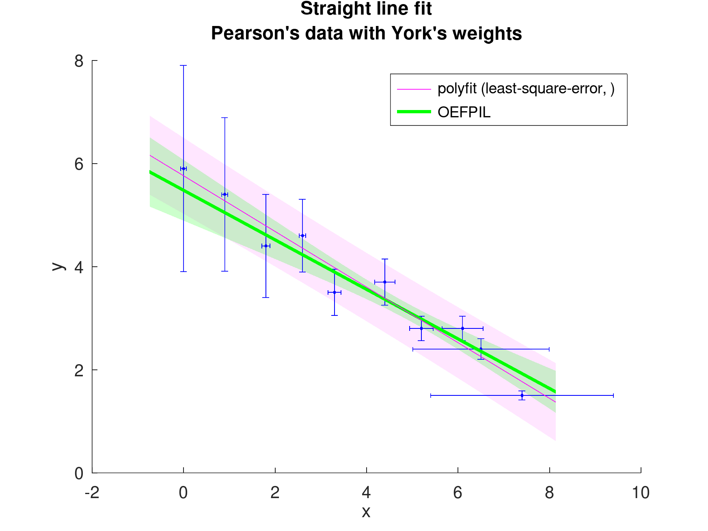

# OEFPIL-OctMAT

GNU Octave/MATLAB Tool for solving linear regression problems with non-linear
parameter constraints. Based on project witkovsky/OEFPIL-MATLAB.

## Why?

OEFPIL:

- fits a general function,
- fits arbitrary number of variables,
- is faster than Monte Carlo method,
- allows to implement general covariance matrix,
- works in both GNU Octave and Matlab.

## Documentation

In GNU Octave or Matlab, run

```Matlab
    help OEFPIL
```

## Example

Several examples are included in subdirectory `Examples`. The typical one use
`Pearson/York` input data. See result of this example:

```text
    Parameters y = beta_1*x + beta_2
             Best estimate   Uncertainty
    beta_1   -0.480533       0.057985
    beta_2   5.47991         0.294971
```


